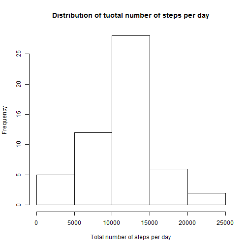
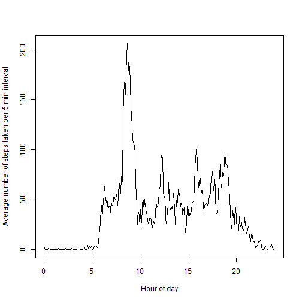
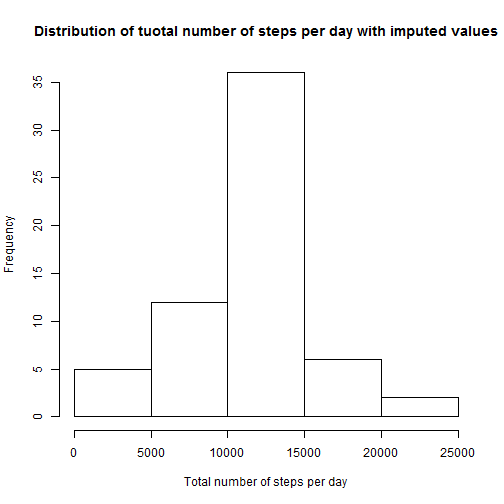
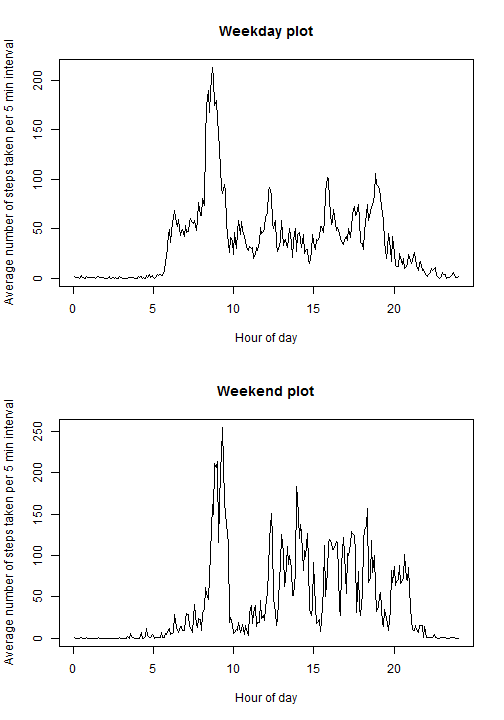

# Load and preprocessing the data
data read from file. date coverted from string to date format


```r
library(lubridate)
data<-read.csv("activity.csv")
data$date<-as.factor(ymd(data$date))
```
# What is the mean total number of steps taken per day?
Calculate total number of steps taken per day
Histogram of total number of steps per day
Mean and median of total number of steps per day


```r
sumsteps<-tapply(data$steps, data$date, sum)
hist(sumsteps, xlab = "Total number of steps per day", main = "Distribution of tuotal number of steps per day")
```

 

```r
mean(sumsteps, na.rm =TRUE)
```

```
## [1] 10766.19
```

```r
median(sumsteps, na.rm =TRUE)
```

```
## [1] 10765
```

# What is the average daily activity pattern?
Time series plot of each 5minute interval and the average number of steps taken, averaged across all days.


```r
fiveminsteps<-tapply(data$steps, data$interval, mean, na.rm= TRUE)
plot((1:288)*5/60,fiveminsteps,type="l", ylab = "Average number of steps taken per 5 min interval", xlab = "Hour of day")
```

 

```r
which(max(fiveminsteps)==fiveminsteps) 
```

```
## 835 
## 104
```
The interval at 8:35AM contains the maximum number of steps.

# Imputing missing values
Fill in NAs with mean from it's specific 5 min interval and store in data2


```r
sum(is.na(data$steps)) 
```

```
## [1] 2304
```

total number of NAs in this dataset is 2304


```r
data2 = data
for (i in 1:nrow(data)){
    data2[i,]=data[i,]
    if (is.na(data2[i,1])){
        data2[i,1] = as.numeric(fiveminsteps[names(fiveminsteps)==data2[i,3]])
    }
}

sumsteps2<-tapply(data2$steps, data2$date, sum)
hist(sumsteps2, xlab = "Total number of steps per day", main = "Distribution of tuotal number of steps per day with imputed values")
```

 

```r
mean(sumsteps2)
```

```
## [1] 10766.19
```

```r
median(sumsteps2)
```

```
## [1] 10766.19
```

data2 is the new dataset with the NAs filled in.
The new mean and median do not differ from the fist part of the assignment.
Imputing the missing data increased the total daily number of step slightly

# Are there differences in activity patterns between weekdays and weekends?
First go through dataset and label Sunday and Saturdays.
Then, relabel Sunday and Saturday as weekend, otherwise, weekday.
Separate weekday and weekend data into new datasets called wday and wend.
xs is a new varible containing the Hour of the day


```r
data2[,4] <- factor(weekdays(as.Date(data2[,2])) == "Sunday")
data2[,4] <- factor(weekdays(as.Date(data2[,2])) == "Saturday")
levels(data2[,4])[levels(data2[,4])=="TRUE"]<-"weekend"
levels(data2[,4])[levels(data2[,4])=="FALSE"]<-"weekday"
names(data2)[4] <- "Day"

wday = data2[data2$Day == "weekday",]
wend = data2[data2$Day == "weekend",]

wdaymean<-tapply(wday$steps, wday$interval, mean)
wendmean<-tapply(wend$steps, wend$interval, mean)
xs <- (1:nrow(wdaymean))*(5/60)
```

Plot results

```r
par(mfrow=c(2,1))
plot(xs,wdaymean,type="l", ylab ="Average number of steps taken per 5 min interval", xlab ="Hour of day", main = "Weekday plot")
plot(xs,wendmean,type="l", ylab ="Average number of steps taken per 5 min interval", xlab ="Hour of day", main = "Weekend plot")
```

 

